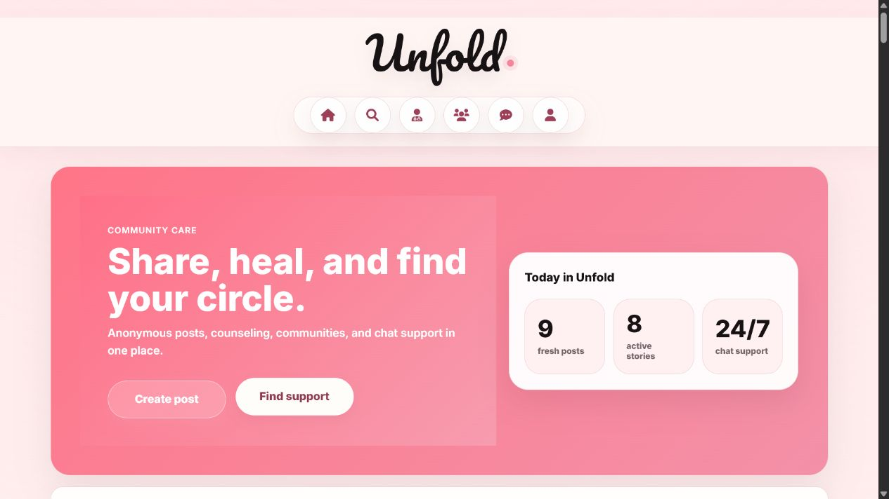
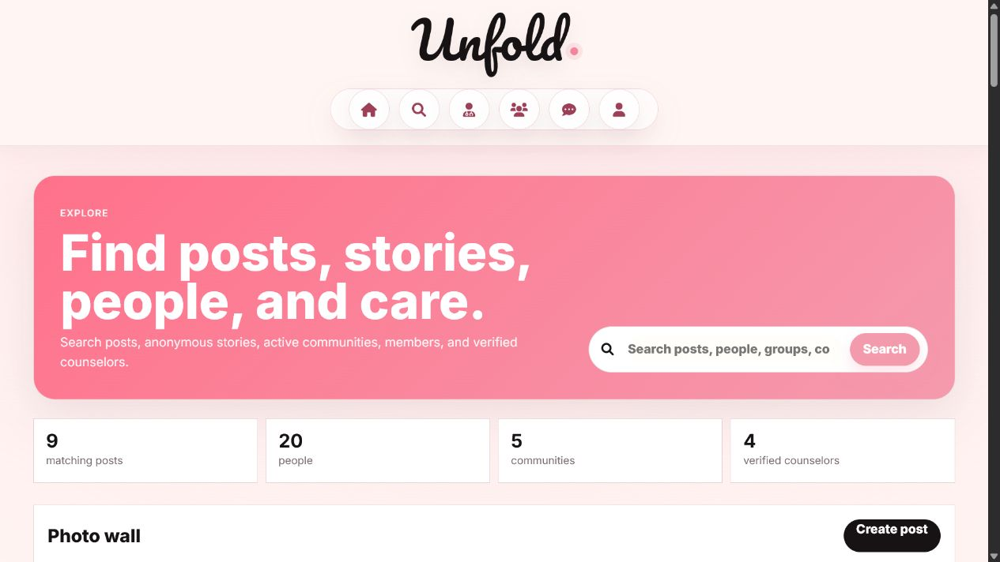
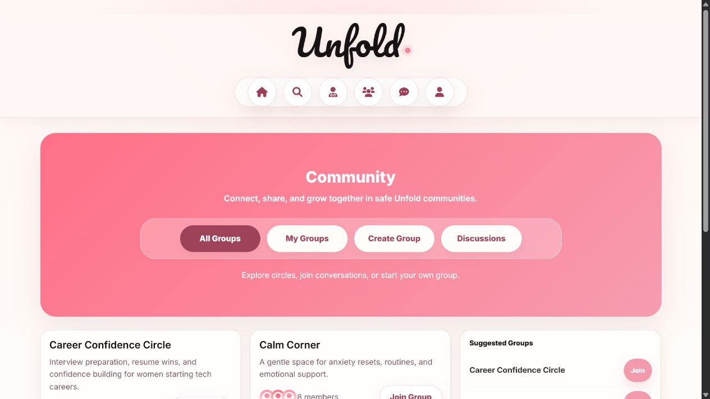
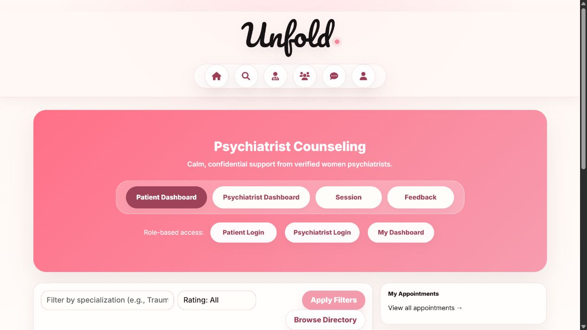

# Unfold


Unfold is a women-focused support platform: anonymous posting, 24-hour stories, community groups, verified-counselor booking, staff moderation, and an AI support assistant, built as a single Django application with server-rendered views.

The design problem it solves is simple: people often want to ask for help or share something difficult without immediately attaching their name to it. Unfold lets a user choose, per post, whether to appear under their real identity or a pseudonym, and that choice is enforced where the content is rendered, not just in the UI.

[Repository](https://github.com/nayana3333/Unfold) · [GitHub Profile](https://github.com/nayana3333)

## Preview

| Home Feed | Explore |
|---|---|
|  |  |

| Community | Counseling |
|---|---|
|  |  |

## Features

| Area | Implementation |
| --- | --- |
| Social feed | Posts, comments, likes, saved posts, image carousels, anonymous posting with pseudonyms |
| Stories | 24-hour ephemeral stories, anonymous display names, identity-safe helper methods |
| Explore | Search across posts, stories, users, groups, and verified counselors |
| Community | Public/private groups, memberships, discussions, pinned/closed threads, comments, likes |
| Counseling | Verified women counselors, availability slots, booking, role-based dashboards, feedback |
| AI assistant | OpenRouter → OpenAI → local rule-based fallback chain, emotion/intent detection, crisis-aware responses |
| Moderation | Staff-only dashboard, polymorphic reporting (posts/discussions/comments), counselor verification, action audit trail |
| Accounts | Registration, roles, profile workspace, account deletion |
| Testing | 48 tests across every app; CI runs the suite and a migration check on every push |

## Design Notes

A few decisions worth calling out, because they're the parts most likely to come up if someone reads the code closely:

**Anonymity is enforced at render time, not hidden client-side.** Anonymous posts are server-rendered from a template branch that never references `post.author` at all — the real username genuinely isn't in the HTML response, rather than being sent to the client and just hidden by CSS/JS. The same pattern applies to stories.

**Private groups check membership before returning content, not just before allowing writes.** Membership was originally checked before letting someone post into a group, but reads (`GroupDetailView`, `DiscussionDetailView`) had no equivalent check — anyone with the URL could view a private group's discussions. Both views now resolve the object through a guard that 404s for non-members, matching the visibility the group settings imply.

**Booking is race-condition-safe, not just validated.** `Booking.clean()` checks psychiatrist verification, slot ownership, and supported session mode, but the harder problem is two patients booking the same slot at once. `BookAppointmentView` wraps slot selection in `select_for_update()` inside a transaction, so a race on the same slot fails cleanly instead of double-booking.

**Moderation reporting is polymorphic, not duplicated per model.** Reports use Django's `ContentType` framework so one `CreateReportView` can flag a post, a discussion, or a comment without three separate report models or views.

**The AI assistant degrades instead of failing.** `generate_reply()` tries OpenRouter, then OpenAI, then falls back to a local rule-based responder if neither key is configured or a request fails — the chat feature works the same day you clone the repo, with no API key required, and upgrades automatically once one is added.

**Uploads are validated server-side.** Post attachments and story videos are restricted to an extension allowlist and a 10 MB size cap via model validators — not just a client-side `accept=` attribute, which is trivial to bypass.

**Insecure production config fails loudly instead of silently.** `DEBUG` defaults to `True` only on a vanilla checkout with no `.env`; if `DEBUG=False` is ever set without also setting a real `SECRET_KEY`, the app raises `ImproperlyConfigured` at startup rather than quietly running in production with the dev key.

## Tech Stack

| Layer | Tools |
| --- | --- |
| Backend | Django 5.2.7, Django ORM, server-rendered templates |
| Data | SQLite for local dev, PostgreSQL-ready via `DATABASE_URL` |
| AI | OpenRouter / OpenAI (`openai` 1.99.9), with a local fallback responder |
| Media | Pillow for image validation, WhiteNoise for static files |
| Testing / CI | Django `TestCase`, GitHub Actions (migration check + full suite on every push) |
| Deployment | Gunicorn, Procfile, environment-driven settings |

## Architecture

```text
Unfold
├── accounts/              # auth, roles, profile workspace
├── stories/               # posts, comments, likes, saved posts, stories, upload validators
├── community/             # groups, discussions, memberships
├── counseling/             # counselor profiles, slots, bookings, feedback
├── chatbot/               # AI/local assistant service and chat history
├── moderation/            # reports, staff dashboard, action audit trail
├── sisterhood_stories/    # settings, root URLs, home and explore views
├── templates/             # server-rendered UI
├── static/                # CSS and shared frontend assets
└── docs/screenshots/      # README images
```

## Local Setup

```bash
git clone https://github.com/nayana3333/Unfold.git
cd Unfold
python -m venv venv
venv\Scripts\activate
pip install -r requirements.txt
copy .env.example .env
python manage.py migrate
python manage.py runserver 8001
```

Open `http://127.0.0.1:8001/`.

To load realistic demo content (sample users, posts, groups, and bookings):

```bash
python manage.py seed_demo --reset-demo
```

## Environment Variables

Copy `.env.example` to `.env`. Locally, only `SECRET_KEY` and `DEBUG=True` are required — everything else has a safe default or degrades gracefully.

```env
SECRET_KEY=change-me
DEBUG=True
ALLOWED_HOSTS=127.0.0.1,localhost
CORS_ALLOW_ALL_ORIGINS=False
CORS_ALLOWED_ORIGINS=
CSRF_TRUSTED_ORIGINS=
DATABASE_URL=
SESSION_COOKIE_SECURE=False
CSRF_COOKIE_SECURE=False
SECURE_SSL_REDIRECT=False

# Optional - the chatbot falls back to a local responder if these are unset
OPENROUTER_API_KEY=
OPENROUTER_MODEL=openai/gpt-4o-mini
OPENAI_API_KEY=
OPENAI_MODEL=gpt-3.5-turbo
CHATBOT_TEMPERATURE=0.65
CHATBOT_MAX_TOKENS=340
CHATBOT_TIMEOUT_SECONDS=25
```

## Testing

```bash
python manage.py test
```

48 tests covering, among other things: anonymous post/story identity behavior, private group and discussion access control, community membership and discussion permissions, file upload validation, chatbot distress detection and provider fallback, counseling booking races and unauthorized actions, and staff-only moderation. GitHub Actions runs a missing-migrations check and the full suite on every push to `main`.

## Deployment

```bash
pip install -r requirements.txt
python manage.py migrate
python manage.py collectstatic --noinput
gunicorn sisterhood_stories.wsgi
```

Before deploying:

- Set `DEBUG=False` and a real `SECRET_KEY` (the app will refuse to start otherwise).
- Configure `ALLOWED_HOSTS` and `CSRF_TRUSTED_ORIGINS`.
- Point `DATABASE_URL` at PostgreSQL.
- Use persistent or object storage for `media/` — the local filesystem won't survive most PaaS deploys.
- Set `OPENROUTER_API_KEY`/`OPENAI_API_KEY` only in the hosting provider's environment, never in source.

## What I'd Build Next

- Object storage + CDN for uploaded media instead of local disk.
- Email or OTP-based account verification.
- A structured counselor onboarding/review form instead of manual admin approval.
- Rate limiting on reports, comments, and chatbot messages.
- Browser-level end-to-end tests for the core user journeys, on top of the existing Django test suite.

## Author

Built by [Nayana](https://github.com/nayana3333).
