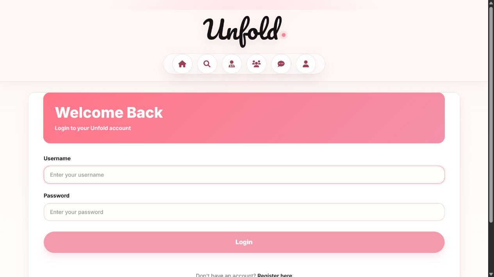

# Unfold

Unfold is a women-focused social support platform built with Django. It combines anonymous posting, short-lived stories, community circles, verified counseling workflows, moderation tools, and an AI support assistant into one calm, privacy-aware web experience.

The product is designed around a simple problem: many people want to ask for help, share experiences, or find support without immediately exposing their identity. Unfold gives users a safe path to participate publicly, anonymously, or through guided care.

[Repository](https://github.com/nayana3333/Unfold) - [GitHub Profile](https://github.com/nayana3333)

## Product Preview

### Home Feed


### Explore


### Community Circles


### Counseling


### Authentication



## What Unfold Includes

| Area | Implementation |
| --- | --- |
| Social feed | Posts, comments, likes, saved posts, image uploads, carousel-style post images, and anonymous posting |
| Stories | 24-hour stories with anonymous display names and identity-safe helper methods |
| Explore | Search and discovery across posts, stories, users, groups, and verified counselors |
| Community | Public/private groups, memberships, discussions, comments, likes, pinned discussions, and closed discussions |
| Counseling | Verified women counselors, availability slots, appointment booking, role-based dashboards, status updates, sessions, and feedback |
| AI assistant | Chat support with OpenRouter/OpenAI integration through environment variables, local fallback responses, emotion/intention detection, and crisis-safe messaging |
| Moderation | Staff-only dashboard, report flow, counselor verification workflow, moderation action logs, and clear empty states |
| Account system | Registration, login/logout, roles, profile workspace, profile metadata, and account deletion |
| Testing | Django tests covering social privacy, profile/explore pages, community permissions, chatbot behavior, counseling booking rules, and staff moderation |

## Why This Project Stands Out

Unfold is not just a CRUD app. It has multiple real product surfaces that work together:

- Privacy-first posting with anonymous and visible identity modes.
- Social platform mechanics: feed, stories, likes, saved posts, comments, groups, and discovery.
- Trust and safety layer: report flow, moderation dashboard, staff-only access, and counselor approval.
- Counseling domain logic: verified counselor filtering, supported session modes, slot booking, cancellation rules, and role-specific dashboards.
- AI support flow with safe fallbacks instead of hard failure when an API key is missing.
- Production-aware settings for environment variables, static files, media, CORS, CSRF, and secure cookies.
- A test suite that checks behavior, permissions, and edge cases across the main modules.

## Tech Stack

| Layer | Tools |
| --- | --- |
| Backend | Django 5.2, Django Templates, Django ORM |
| Data | SQLite for local development, PostgreSQL-ready through `DATABASE_URL` |
| UI | HTML, CSS, server-rendered Django templates, Font Awesome icons |
| AI | OpenRouter/OpenAI-ready service layer with local fallback logic |
| Static files | WhiteNoise, Django staticfiles |
| Testing | Django `TestCase`, system checks, focused workflow tests |
| Deployment | Gunicorn, Procfile, environment-based settings |

## Architecture

```text
Unfold
+-- accounts/              # auth, roles, profile workspace
+-- stories/               # posts, comments, likes, saved posts, stories
+-- community/             # groups, discussions, memberships
+-- counseling/            # counselor profiles, slots, bookings, feedback
+-- chatbot/               # AI/local assistant service and chat history
+-- moderation/            # reports, staff dashboard, action audit trail
+-- sisterhood_stories/    # settings, root URLs, home and explore views
+-- templates/             # product UI templates
+-- static/                # shared CSS and frontend assets
+-- docs/screenshots/      # README screenshots
```

## Key Engineering Details

### Anonymous Sharing

Users can decide at posting time whether their account name should be visible or whether the content should appear under a pseudonym. The same privacy pattern is supported for stories, so users can share experiences without exposing their identity in public areas.

### Counseling Rules

Only verified women counselor profiles are shown for appointment booking. The booking model validates counselor eligibility, slot ownership, and supported session modes. Patients and counselors have different permissions for confirmation, cancellation, completion, and feedback.

### Moderation

The moderation dashboard is restricted to staff users. Reports can be moved through review states, counselor registrations can be approved or rejected, and moderation actions are recorded with reviewer context.

### AI Support

The chatbot uses environment-based provider settings. If an external provider key is not available, the assistant falls back to a local response system instead of breaking the user experience. Distress-related prompts receive safer, more careful responses.

## Local Setup

```bash
git clone https://github.com/nayana3333/Unfold.git
cd Unfold
python -m venv venv
venv\Scripts\activate
pip install -r requirements.txt
copy .env.example .env
python manage.py migrate
python manage.py runserver 8001
```

Open:

```text
http://127.0.0.1:8001/
```

## Environment Variables

Create a `.env` file from `.env.example`.

```env
SECRET_KEY=change-me
DEBUG=True
ALLOWED_HOSTS=127.0.0.1,localhost
DATABASE_URL=
OPENROUTER_API_KEY=
OPENROUTER_MODEL=openai/gpt-4o-mini
OPENROUTER_SITE_URL=http://127.0.0.1:8001
OPENROUTER_APP_NAME=Unfold
```

API keys are intentionally not committed. The app can still run locally without an AI provider key because the chatbot has a local fallback.

## Testing

Run the full Django test suite:

```bash
python manage.py test
```

Current coverage includes:

- anonymous post and story identity behavior
- profile and explore page rendering
- community membership and discussion permissions
- chatbot input handling, distress handling, and provider fallback
- counseling booking rules and unauthorized booking actions
- staff-only moderation dashboard and report status controls

Latest local result:

```text
41 tests passed
System check identified no issues
```

## Deployment Notes

The project is prepared for deployment with environment-based settings.

Recommended production setup:

```bash
pip install -r requirements.txt
python manage.py migrate
python manage.py collectstatic --noinput
gunicorn sisterhood_stories.wsgi
```

Production checklist:

- Set `DEBUG=False`.
- Set a secure `SECRET_KEY`.
- Configure `ALLOWED_HOSTS` and `CSRF_TRUSTED_ORIGINS`.
- Use PostgreSQL through `DATABASE_URL`.
- Store media files in persistent storage or object storage.
- Add `OPENROUTER_API_KEY` only in the hosting provider's environment variables.

## Future Improvements

- Cloud media storage with CDN delivery.
- Email or OTP-based account verification.
- A formal counselor onboarding review form.
- More granular notification preferences.
- Rate limiting for reports, comments, and chatbot messages.
- End-to-end browser tests for core user journeys.

## Author

Built by [Nayana](https://github.com/nayana3333).
